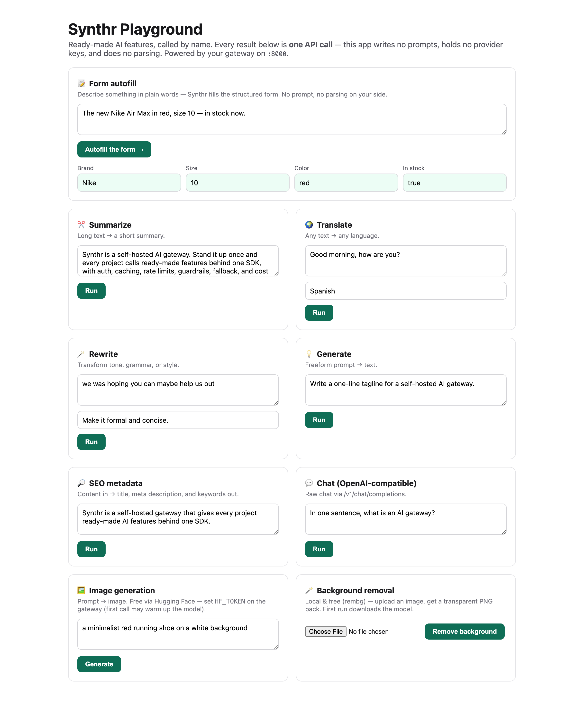
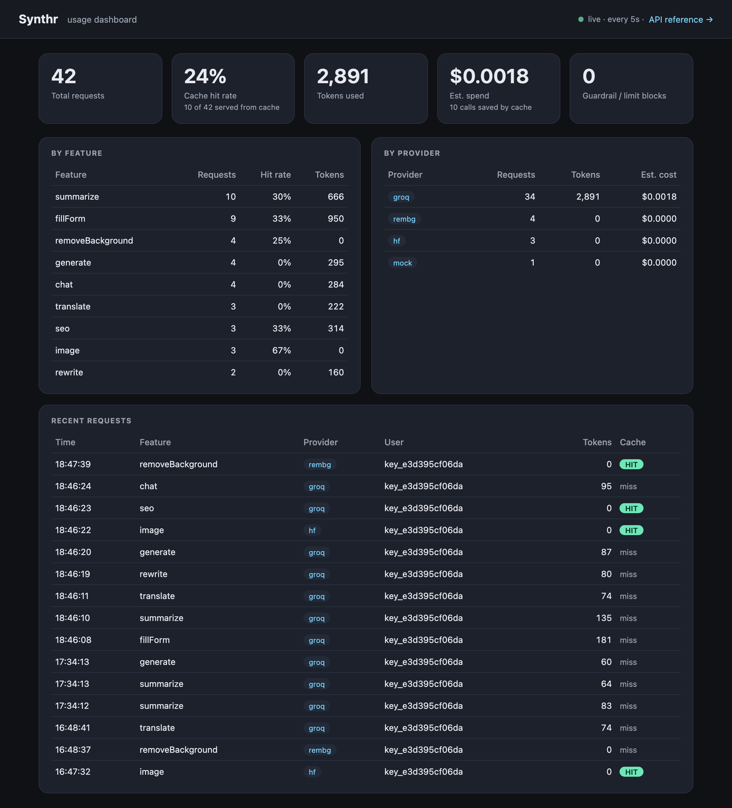

# Synthr

*Pronounced “sin-ther”.*

**Synthr is a self-hosted AI feature gateway.** Add AI features to any app through one SDK — without exposing provider keys, writing prompts, or rebuilding the same AI plumbing in every project.

*Call the feature, not the model — one gateway for every project, from any stack.*

- 🧩 **Ready-made AI features** — form autofill · summarize · translate · rewrite · SEO metadata · image generation · background removal *(catalog keeps growing)*
- 📦 **One SDK for every project** — same gateway, same auth, same response shape, from frontend, backend, or any language
- 🔌 **Provider-agnostic** — Gemini · OpenAI · Groq · Grok · Ollama · Hugging Face · rembg · mock, chosen per feature in config
- 🛡️ **Frontend-safe** — public project keys with an origin allowlist; real provider keys never touch the browser
- ⚙️ **Built-in AI infrastructure** — cache · rate limits · budgets · guardrails · provider fallback + circuit breaker · background jobs · usage/cost dashboard, on every call
- 🔁 **OpenAI-compatible** — already using the OpenAI SDK? Point its base URL at Synthr and keep your code

You call a feature **by name**; Synthr owns the prompt, picks the provider, and handles the plumbing. **One setup, every project — nothing to build on your end.**


[](https://github.com/Sufian-Abu/synthr/actions/workflows/ci.yml)


> **▶ See it running:** the [**Next.js playground**](examples/nextjs/) calls every feature live (form autofill, image, background removal, …) through one gateway — start there.

> **Status: working MVP — self-host, learn, and build on it.** Every piece runs end-to-end, but it's tuned for a single team on one box, not yet hardened for untrusted or high-concurrency production. See [Status & roadmap](#status--roadmap) for what's done and what's next.

---

## Contents

[The problem](#the-problem) · [What it solves](#what-we-built-and-what-it-solves) · [See it](#see-it-in-action) · [What Synthr does](#what-synthr-does) · [Who is this for?](#who-is-this-for) · [Architecture](#architecture) · [Quickstart](#quickstart) · [Calling it](#calling-it) · [OpenAI-compatible API](#openai-compatible-api) · [Features](#features) · [Providers](#providers) · [Configuration](#configuration) · [Under the hood](#under-the-hood) · [Dashboard](#dashboard) · [Project layout](#project-layout) · [Status & roadmap](#status--roadmap)

---

## The problem

"Add AI to the app" sounds like one task. It isn't. The model call is a few lines — but to ship it *safely* and *for real*, every team rebuilds the same scaffolding, in every project, from scratch:

- **Prompts & parsing.** You write a prompt for "extract these fields," coax the model into clean JSON, then write parsing + validation when it drifts. Next feature, next project — do it again.
- **Leaked keys.** The fastest way to call a model from the frontend is to put the provider key in the client — where anyone can open devtools and drain your account. So you stand up a backend proxy… per app.
- **Runaway cost.** One bug, one abusive user, or one retry loop quietly burns the month's budget. There's no per-project cap and no hard stop.
- **Paying for the same answer.** The same prompt gets sent — and billed — over and over, with no cache.
- **Sensitive data to third parties.** Emails, cards, and SSNs flow straight to the model unless someone remembers to scrub them. Usually no one does.
- **No cost visibility.** Nobody can answer "what is AI costing us, per project?" until the invoice lands.
- **Provider lock-in.** Switching from one provider to another — or using a cheap one for drafts and a strong one for prod — means rewriting application code.
- **Slow endpoints block requests.** Image generation and background removal take seconds and tie up a request thread/connection.

None of this is the *feature*. It's the same plumbing, re-soldered in every repo — and it's where the bugs, the leaks, and the surprise bills come from.

## What we built (and what it solves)

**Synthr is one self-hosted gateway that owns all of that plumbing, so your app just calls the feature by name.** You run it once; every project talks to it through one tiny SDK (or plain REST). Each problem above maps to something Synthr handles for you:

| The problem | What Synthr does |
|---|---|
| Prompts & parsing per feature | **Ready-made features** (`fillForm`, `summarize`, `extract`, …) — Synthr owns the prompt and returns validated, structured data |
| Provider keys leak to the frontend | Real keys live **only in the gateway**; apps use **project keys** — public `pk_` keys are origin-locked and browser-safe |
| Runaway cost | **Hard budgets** — daily/monthly/per-feature caps that reject once exceeded |
| Paying for repeat answers | Built-in **cache** (exact + opt-in semantic) — the same prompt is served free |
| Sensitive data leaving | **Guardrails** — PII/keyword blocks on input, PII redaction on output, before the model sees it |
| No cost visibility | Every call **logged with tokens + USD**, on a per-project **dashboard** |
| Provider lock-in | Provider is **one line of config per feature** — swap anytime, zero app code; automatic **fallback + circuit breaker** |
| Slow endpoints block requests | **Background jobs** — submit and poll instead of holding a connection |

**One setup. Every project. No repeated plumbing.**

## See it in action

The [**Next.js playground**](examples/nextjs/) calls every feature live — each result is **one API call**, with no prompts and no provider keys on the client:

<p align="center">
  
</p>

And the built-in **dashboard** answers "what is AI costing us?" — requests, cache-hit rate, tokens, spend, and per-feature / per-provider breakdowns, per project:

<p align="center">
  
</p>

## What Synthr does

Synthr is a **self-hosted gateway that turns AI into ready-made features**. Instead of standing up a model and engineering prompts, your app calls a capability — Synthr owns the prompt, the provider, and the plumbing behind it.

```python
ai.fill_form(fields=[...], context="Nike Air Max, red, size 10")
# → {"values": {"brand": "Nike", "color": "red", "size": 10}, "unfilled": []}
```

**Ready-made features, out of the box:**

- **Fill forms** — messy text into a strict, validated schema
- **Summarize** · **Translate** · **Rewrite** · **Generate** — everyday text tasks
- **SEO metadata** — content into title, description, keywords
- **Classify** · **Extract** · **Moderate** — label text, pull structured records, flag unsafe content
- **Embed** — text → vectors (for search / similarity)
- **Generate images** — from a text prompt
- **Remove image backgrounds** — a local, non-LLM model
- **OpenAI-compatible chat** — point the OpenAI SDK at `/v1/chat/completions`

**The catalog keeps growing — and every feature is zero-effort for the caller.** You call the name; Synthr owns the prompt, the provider, and the plumbing. Each call automatically gets auth, caching, rate limits, guardrails, provider fallback, and cost logging. Which provider powers each feature is **one line of config** — swap it anytime with zero app code. Adding a new feature is a small package on Synthr's side; **the apps that use it change nothing.**

## Who is this for?

- **Agencies & dev shops** shipping AI across many client projects — stand Synthr up once, reuse it everywhere, no per-repo plumbing.
- **SaaS teams** that want one governed place for AI: central keys, per-project rate limits, PII guardrails, and a single cost dashboard.
- **Internal-tools / platform teams** giving product engineers safe, self-serve AI features without handing out raw provider keys.

If you call a model from more than one codebase, Synthr is the shared layer that keeps the plumbing in one place.

## Architecture

<p align="center">
  
</p>

Every request walks the same path: **authenticate → guardrails → rate limit → cache → optimize → route (with fallback) → log usage**. Each step is a small, independent module, so adding a feature or a provider doesn't touch the rest.

## Quickstart

**Docker — one command:**

```bash
cp synthr.config.example.yaml synthr.config.yaml   # what runs what
cp .env.example .env                               # your provider keys
docker compose up                                  # gateway on :8000
```

**Or local (Python 3.12+):**

```bash
pip install -e .
cp synthr.config.example.yaml synthr.config.yaml && cp .env.example .env
uvicorn "synthr_gateway.app:create_app" --factory --port 8000
```

The shipped config boots with no keys (it falls back to a mock provider), so the server comes up either way. Add a `GEMINI_KEY` or `GROQ_KEY` to `.env` to get real answers. Then visit:

- **Dashboard** → http://localhost:8000/dashboard
- **API reference (ReDoc)** → http://localhost:8000/redoc

## Calling it

First-party SDKs ship for **Python** and **TypeScript/JS**; every other language uses the **REST** endpoint directly — it's just a `POST` with a header. The endpoints and the response shape are identical everywhere — call the **same gateway** from anywhere:

| Where | How | Key |
|---|---|---|
| **Frontend / browser** | `synthr-sdk` (npm) or `fetch` | **public** `pk_proj_…` — origin-locked, browser-safe |
| **Backend** (Node, Python, Go, …) | `synthr` (pip) · `synthr-sdk` (npm) · REST | **secret** `sk_proj_…` |
| **Any language / scripts / CLI** | plain REST `POST /v1/<feature>` · `curl` | secret `sk_proj_…` |

The SDKs aren't published to PyPI/npm yet, so install them from this repo:

```bash
pip install ./sdk/python          # Python      → from synthr import AI
npm  install ./sdk/typescript     # TypeScript / JavaScript
```

The same call in each — `summarize` here, but every feature follows the same shape:

**Python**
```python
from synthr import AI

ai = AI(key="sk_proj_...")                 # url defaults to $SYNTHR_URL or http://localhost:8000
result = ai.summarize(text="…long text…", max_words=20)
print(result["summary"])
# AsyncAI is identical with await. Errors raise SynthrError(.code, .message, .retry_after).
```

**TypeScript / JavaScript**
```ts
import { AI } from "synthr-sdk";

const ai = new AI({ url: "http://localhost:8000", key: "sk_proj_..." });  // pk_proj_ in the browser
const { summary } = await ai.summarize("…long text…", 20);
```

**REST (any language)**
```bash
curl -X POST http://localhost:8000/v1/summarize \
  -H "Content-Type: application/json" \
  -H "X-Project-Key: sk_proj_..." \
  -d '{"text":"…long text…","max_words":20}'
```

**Go (standard library — no SDK needed)**
```go
body, _ := json.Marshal(map[string]any{"text": "…long text…", "max_words": 20})
req, _ := http.NewRequest("POST", "http://localhost:8000/v1/summarize", bytes.NewReader(body))
req.Header.Set("Content-Type", "application/json")
req.Header.Set("X-Project-Key", "sk_proj_...")
resp, _ := http.DefaultClient.Do(req)
defer resp.Body.Close()
```

A full **Next.js** example — secret key on the server, public key in the browser — is in **[examples/nextjs/](examples/nextjs/)**.

### CLI

| Command | What it does |
|---|---|
| `synthr init` | Scaffold `synthr.config.yaml` + `.env` |
| `synthr keygen` | Mint a project key — add `--public` for a browser-safe key |
| `synthr status` | Ping a running gateway and print its health |

Full reference — auth, every endpoint, error codes — is in **[USAGE.md](USAGE.md)**.

## OpenAI-compatible API

Already invested in the OpenAI SDK (or LangChain, the Vercel AI SDK, LlamaIndex)? You don't have to rewrite anything — point `base_url` at Synthr and use your **project key**. The endpoint speaks the OpenAI Chat Completions wire format, and every call still runs through the full pipeline (auth, guardrails, rate limits, cache, provider fallback, cost logging).

```python
from openai import OpenAI

client = OpenAI(
    base_url="http://localhost:8000/v1",   # Synthr, not api.openai.com
    api_key="sk_proj_...",                  # your Synthr project key
)
resp = client.chat.completions.create(
    model="gemini-flash-latest",            # forwarded to the provider set in config
    messages=[{"role": "user", "content": "Say hello in one word."}],
)
print(resp.choices[0].message.content)
```

```ts
import OpenAI from "openai";

const client = new OpenAI({ baseURL: "http://localhost:8000/v1", apiKey: "sk_proj_..." });
const r = await client.chat.completions.create({
  model: "gemini-flash-latest",
  messages: [{ role: "user", content: "Say hello in one word." }],
});
```

- **Auth** — `Authorization: Bearer <project-key>` (what the SDK sends) or `X-Project-Key`.
- **Provider** — chosen by the `chat` feature in your config, not by the caller (that's the point of Synthr). The request's `model` is forwarded to that provider and echoed back as the response `model`.
- **Streaming** — `stream=True` returns OpenAI-style `chat.completion.chunk` SSE events.
- **Tools** — pass `tools=[...]`; tool calls come back on `choices[0].message.tool_calls`, including for Gemini (its different `functionDeclarations` wire format is mapped under the hood).
- **Errors** — returned in OpenAI's `{ "error": { … } }` shape, so the SDK's error handling works.

> This re-exposes *raw chat* — the opposite of Synthr's capability-layer pitch (call `fillForm`, not chat). It's here for drop-in migration and the cases a named feature doesn't cover; reach for the [features](#features) first. **Note:** streamed responses skip the cache and output-PII redaction (input guardrails + rate limits still apply).

## Features

Each feature takes plain inputs and returns structured data — **no prompt engineering, no setup on your side.** Call the name; that's it.

| Feature | Endpoint | What it does |
|---|---|---|
| **Form autofill** | `POST /v1/fillForm` | Extracts values from free text into a schema you define. Unknown fields come back `null` — never guessed. |
| **Summarize** | `POST /v1/summarize` | Condenses text, with an optional `max_words` cap. |
| **Translate** | `POST /v1/translate` | Translates text into any `target_lang`. |
| **Rewrite** | `POST /v1/rewrite` | Transforms `text` per an `instruction` — grammar, tone, length, style. |
| **Generate** | `POST /v1/generate` | Freeform prompt → text. The escape hatch when no named feature fits. |
| **SEO metadata** | `POST /v1/seo` | Turns content into a page title, meta description, and keywords. |
| **Classify** | `POST /v1/classify` | Single-label classification over caller-defined `labels` (+ confidence). |
| **Extract** | `POST /v1/extract` | Pulls a **list** of structured records from text (fillForm's bigger sibling). |
| **Moderate** | `POST /v1/moderate` | Content-safety flag + categories + reason. |
| **Embed** | `POST /v1/embed` | Text → embedding vector(s), one string or a batch. |
| **Image generation** | `POST /v1/image` | Generates an image from a text prompt. Backend-only by default. |
| **Background removal** | `POST /v1/removeBackground` | Strips an image background with a local `rembg` model — proof that non-LLM providers fit the same pipeline. |
| **Background jobs** | `POST /v1/jobs` · `GET /v1/jobs/{id}` | Run any feature async (for slow image/bg work); submit, then poll for the result. |
| **OpenAI chat** | `POST /v1/chat/completions` | [Drop-in OpenAI-compatible](#openai-compatible-api) chat for existing SDK code. |

**This list is meant to grow.** Adding a feature is a small package under `features/` plus a route — and it **automatically inherits** auth, caching, rate limits, guardrails, fallback, and cost logging. Consumers don't change a line; the new capability is just *there*. (See [CONTRIBUTING.md](CONTRIBUTING.md) for the recipe.)

### How form autofill works (it's dynamic)

The important bit: **you define the form in the request.** The `fields` array is caller-supplied and fully dynamic — Synthr stores no schema and assumes nothing, so every form can be different. You pass the fields *you* want plus the `context` text you have; Synthr returns a value per field, or `null` (listed in `unfilled`) when it isn't in the text — it never guesses.

- **Who uses it:** any app with a form (onboarding, CRM lead capture, checkout, support tickets) that has some text — an email, a chat message, a transcript, a product blurb — and wants it as structured fields.
- **What they do:** send `{ fields: [...your form...], context: "...the text..." }`. No prompt, no per-form code.

```bash
# A support-ticket form — totally different fields, same endpoint:
curl -X POST http://localhost:8000/v1/fillForm -H "X-Project-Key: sk_proj_demo_secret" \
 -d '{"fields":[{"name":"priority","type":"string","options":["low","medium","high"]},
              {"name":"category","type":"string"},{"name":"summary","type":"string"}],
     "context":"My checkout keeps crashing on payment — urgent, I am losing sales."}'
# → {"data":{"values":{"priority":"high","category":"checkout/payment",
#                      "summary":"Checkout crashes on payment"},"unfilled":[]}}
```

`type` can be `string` / `number` / `integer` / `boolean`, and `options` constrains a field to a fixed set (anything else comes back `null`).

### Examples for every feature

All return the envelope `{ "data": …, "meta": … }`; only `data` is shown.

```bash
# Summarize
curl …/v1/summarize -d '{"text":"<long text>","max_words":12}'
# → {"summary":"A short, accurate summary."}

# Translate
curl …/v1/translate -d '{"text":"Good morning","target_lang":"Spanish"}'
# → {"translation":"Buenos días"}

# Rewrite
curl …/v1/rewrite -d '{"text":"we was hoping you can help","instruction":"Make it formal."}'
# → {"text":"We were hoping you could assist us."}

# Generate (freeform)
curl …/v1/generate -d '{"prompt":"A one-line tagline for a self-hosted AI gateway."}'
# → {"text":"Ready-made AI for every project."}

# SEO metadata
curl …/v1/seo -d '{"content":"<your page content>"}'
# → {"title":"…","description":"…","keywords":["…","…"]}

# Image generation (needs a paid or free-tier image provider — see Providers)
curl …/v1/image -d '{"prompt":"a red running shoe on white","size":"1024x1024"}'
# → {"images":[{"b64":"<base64-png>","mime":"image/png"}]}

# Background removal (local, free — needs the `vision` extra)
curl …/v1/removeBackground -d '{"image":"<base64>"}'      # or {"image_url":"https://…"}
# → {"image":{"b64":"<transparent-png>","mime":"image/png"}}

# Chat (OpenAI-compatible) — see "OpenAI-compatible API" above
curl …/v1/chat/completions -H "Authorization: Bearer sk_proj_…" \
  -d '{"model":"<your-model>","messages":[{"role":"user","content":"hi"}]}'
```

(Every `curl …` above also needs `-H "X-Project-Key: sk_proj_…"` and `-H "Content-Type: application/json"`. The full reference is in [USAGE.md](USAGE.md).)

## Providers

Pick per feature in config; swap with a one-line change, zero app code.

| Provider | `kind` | Notes |
|---|---|---|
| Gemini | `gemini` | native API, structured output + Imagen |
| OpenAI | `openai` | text + images |
| Grok (xAI) | `grok` | keys start `xai-` |
| Groq | `groq` | fast inference; keys start `gsk_` |
| Ollama | `ollama` | local, no key, $0 |
| Hugging Face | `huggingface` | **free text-to-image** (FLUX / SDXL); token starts `hf_` |
| rembg | `rembg` | local background removal (the `vision` extra) |

> **Adapter note.** OpenAI, Grok, Groq, and Ollama are close but not identical, so each gets its **own adapter** (a shared base + per-provider subclass) rather than one catch-all: OpenAI uses strict `json_schema` structured output while the others use `json_object`; only OpenAI and Grok generate images (and xAI ignores `size`); each provider's error *body* maps to a typed code (`provider_rate_limited` / `provider_safety_blocked` / …); and **streaming (SSE)** and **tool-calling** are handled per provider (incl. Gemini's different `functionDeclarations` shape). Streaming and tool-calling are reachable today through the [OpenAI-compatible API](#openai-compatible-api).

> **Free image generation.** Text is easy to get free (Groq/Gemini); **image generation is not** — Gemini Imagen and OpenAI `gpt-image-1` are paid. Synthr ships a built-in **Hugging Face** provider for **free** text-to-image: grab a free token at [huggingface.co/settings/tokens](https://huggingface.co/settings/tokens), put it in `.env` as `HF_TOKEN`, and point the `image` feature at it:
> ```yaml
> providers:
>   hf: { kind: huggingface, api_key: "${HF_TOKEN}" }
> features:
>   image: { provider: hf, model: black-forest-labs/FLUX.1-schnell }
> ```
> (HF free models can be rate-limited and "warm up" on first call — Synthr returns a clear `warming up, retry shortly` message. Other free routes: a local Stable-Diffusion server like ComfyUI/AUTOMATIC1111. **Ollama does *not* generate images** — it's text/vision only.)

## Configuration

One file — `synthr.config.yaml` — wires everything: the **providers** (and their keys), which provider powers each **feature**, and per-**project** keys, limits, and budgets. The shape:

```yaml
providers:                          # define only the ones you use; keys come from .env
  gemini: { kind: gemini, api_key: "${GEMINI_KEY}" }
  groq:   { kind: groq,   api_key: "${GROQ_KEY}" }

features:
  summarize:
    provider: groq                  # which provider runs this feature
    model: llama-3.3-70b-versatile
    frontend_safe: true             # callable from a public (browser) key
    fallback: { provider: gemini, model: gemini-flash-latest }   # used if the primary errors
    cache: { enabled: true, mode: exact }
    guardrails: { redact_output_pii: true }                      # scrub PII from the response

projects:
  demo:
    keys:
      - { id: sk_proj_demo_secret, type: secret }
      - { id: pk_proj_demo_public, type: public, allowed_origins: ["http://localhost:3000"] }
    limits: { per_user: { daily_requests: 100 } }
    budget: { daily_usd: 5, daily_requests: 5000 }               # hard caps — optional
```

Pointing a feature at a different provider is a one-line change, with no application code. The full, commented file is **[synthr.config.example.yaml](synthr.config.example.yaml)**, and `synthr init` scaffolds it for you.

## Under the hood

- **Auth** — dual keys: `sk_proj_…` for backends, `pk_proj_…` for browsers (origin-checked, feature-gated). Keys are matched by **sha256 hash** (constant-time compare) and support **scopes, expiry, and revoke**; auth failures are logged as audit events. **CORS** is opened only to the origins declared on public keys (no wildcard), so browser calls actually work. Real provider keys never leave the gateway.
- **Cache** — exact match by default; opt-in **TF-IDF semantic** cache for text features, with a conservative similarity threshold (tune or disable it per feature).
- **Rate limits** — sliding window per user, per day/week/month.
- **Budgets** — hard per-project caps (daily/monthly request + USD, and per-feature daily) — over-limit requests are rejected with `402 budget_exceeded`.
- **Guardrails** — regex PII/keyword/length checks on input; PII redaction on output. Blocks are logged.
- **Token optimizer** — strips redundant whitespace from prompts before they go out.
- **Fallback + circuit breaker** — fails over to the configured fallback on timeout/rate-limit/error; after repeated failures a provider's circuit opens and it's skipped until it recovers.
- **Background jobs** — slow features run async on a worker thread: `POST /v1/jobs` → `GET /v1/jobs/{id}`.
- **Usage & cost** — every request logged to SQLite with tokens and an estimated USD cost; surfaced on the dashboard.

## Dashboard

`/dashboard` is server-rendered (HTMX, no build step) and refreshes itself. It shows total requests, cache-hit rate, tokens, estimated spend, guardrail/redaction events, and per-feature / per-provider breakdowns — all from the SQLite usage log. (Screenshot in [See it in action](#see-it-in-action); regenerate it with `python scripts/capture_dashboard.py`.)

## Project layout

Three pillars: the **gateway** service, the **SDKs**, and supporting files.

```
synthr/
├── src/synthr_gateway/        ← the gateway service (FastAPI)
│   ├── app.py                 app factory + middleware
│   ├── api/                   v1 routes, deps, health, shared runner
│   ├── features/              one package per capability (fillform, summarize, translate, image, removebg)
│   ├── providers/             base + adapters (gemini, openai-compat, rembg, mock) + registry
│   ├── security/              dual-key auth + origin checks
│   ├── guardrails/            input checks + output PII redaction
│   ├── cache/                 exact + TF-IDF semantic + manager
│   ├── ratelimit/             sliding-window limiter + policy
│   ├── optimizer/             prompt compression
│   ├── usage/                 request logging + USD pricing
│   ├── dashboard/             HTMX routes + templates
│   ├── config/                schema + loader (synthr.config.yaml, .env)
│   └── core/                  errors + response envelope
│
├── sdk/python/                ← first-party Python client   (synthr)
├── sdk/typescript/            ← first-party TS / JS client   (synthr-sdk)
│
├── examples/                  REST / Python / JS usage
├── tests/                     pytest suite (gateway + SDK)
├── docs/                      architecture diagram + ADRs (docs/adr/)
├── Dockerfile · docker-compose.yml
└── synthr.config.example.yaml · .env.example
```

## Tests

```bash
pip install -e ".[dev]"
pytest                  # 98 gateway tests
ruff check src tests    # lint
mypy                    # type-check
```

`pip install -e sdk/python && pytest sdk/python` runs the 3 SDK tests. All three checks (lint · type-check · tests) run in **CI** on every push and PR — see [.github/workflows/ci.yml](.github/workflows/ci.yml).

## Status & roadmap

Synthr runs end-to-end — every feature, the full request pipeline, the dashboard, both SDKs, Docker. It's a **working MVP, not a hardened production system**: it's built for a single team on one box (SQLite, single process), not yet for untrusted or high-concurrency multi-tenant traffic. **[ROADMAP.md](ROADMAP.md)** tracks the path there (Postgres, Redis, durable job queue, tracing, published SDKs), and the security model is in **[SECURITY.md](SECURITY.md)**.

A few things are deliberately not done yet:

- **SDKs aren't published** to PyPI/npm — install from the `sdk/` folders.
- The **token optimizer** is lossless whitespace compression — conservative, not a magic 30%.
- The **semantic cache** uses TF-IDF; swapping in embeddings is a clean upgrade.
- **Guardrails** are regex-based; **storage** is SQLite. Fine for a single team, not for hostile multi-tenant load.

## Contributing

Adding a feature or a provider is meant to be cheap — and consumers never change. See
**[CONTRIBUTING.md](CONTRIBUTING.md)** for the recipe, the design rationale in
**[docs/adr/](docs/adr/)**, and the security model in **[SECURITY.md](SECURITY.md)**.

## License

MIT.
