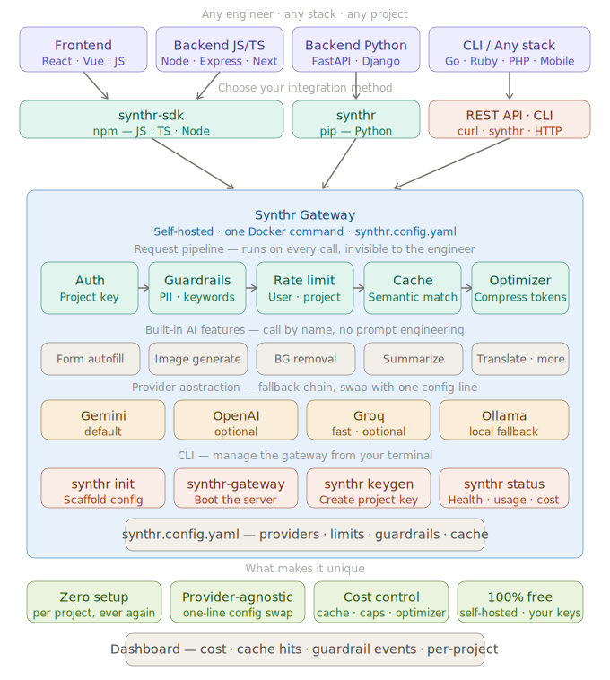

# Synthr

*Pronounced “sin-ther” — synthesize + route.*

**A self-hosted AI gateway that gives every project ready-made AI features behind one tiny SDK.**
Stand it up once, configure it per project, and your apps just call the feature they need — no prompts to write, no provider keys in your frontend, no per-project plumbing to maintain.


> **Status: working MVP — self-host, learn, and build on it.** Every piece runs end-to-end, but it's tuned for a single team on one box, not yet hardened for untrusted or high-concurrency production. See [Maturity & limitations](#maturity--limitations) for the honest, line-by-line breakdown.

---

## Contents

[The problem](#the-problem) · [What Synthr does](#what-synthr-does) · [Who is this for?](#who-is-this-for) · [Why not the OpenAI SDK?](#why-not-just-the-openai-sdk) · [Maturity & limitations](#maturity--limitations) · [Architecture](#architecture) · [Quickstart](#quickstart) · [Calling it](#calling-it) · [Features](#features) · [Providers](#providers) · [Configuration](#configuration) · [Under the hood](#under-the-hood) · [Dashboard](#dashboard) · [Project layout](#project-layout) · [Status & roadmap](#status--roadmap)

---

## The problem

Every product wants AI features now — form autofill, image generation, background removal, translation, summarization. But every time one lands in the sprint, engineers rebuild the same invisible plumbing: hide the API key, pick a provider, write the prompt, rate-limit users, block sensitive data, cache repeat calls, track the cost. **Same work. Every project. From scratch.**

**Synthr is the shared layer that handles all of it.** Run one Docker container for your team, drop the SDK into any project, and call the feature you need. Synthr checks rate limits, scans for PII, and serves a cached response when one already exists — all before the model is ever called — then routes the request to the right provider and logs what it cost.

**One setup. Every project. No repeated plumbing.**

## What Synthr does

Synthr is a **self-hosted gateway that turns AI into ready-made features**. Instead of standing up a model and engineering prompts, your app calls a capability — Synthr owns the prompt, the provider, and the plumbing behind it.

```python
ai.fill_form(fields=[...], context="Nike Air Max, red, size 10")
# → {"values": {"brand": "Nike", "color": "red", "size": 10}, "unfilled": []}
```

**Out of the box it can:**

- **Fill forms** — turn messy text into a strict, validated schema
- **Summarize** — condense long text to a length you choose
- **Translate** — into any target language
- **Generate images** — from a text prompt
- **Remove image backgrounds** — via a local, non-LLM model

Every call automatically gets auth, caching, rate limits, guardrails, provider fallback, and cost logging. **Which provider powers each feature is one line of config** — swap it anytime with zero app code. Engineers never touch prompts, keys, or providers; they just use the feature.

## Who is this for?

- **Agencies & dev shops** shipping AI across many client projects — stand Synthr up once, reuse it everywhere, no per-repo plumbing.
- **SaaS teams** that want one governed place for AI: central keys, per-project rate limits, PII guardrails, and a single cost dashboard.
- **Internal-tools / platform teams** giving product engineers safe, self-serve AI features without handing out raw provider keys.

If you call a model from more than one codebase, Synthr is the shared layer that keeps the plumbing in one place.

## Why not just the OpenAI SDK?

A provider SDK (OpenAI's, Gemini's, anyone's) gives you a *raw model call*. You still build everything around it, in every project:

| With a provider SDK | With Synthr |
|---|---|
| Wire up the SDK, write prompts per feature | Call a feature: `fill_form(...)`, `summarize(...)` |
| Keys live in each app (and leak to frontends) | Keys live only in the gateway; apps hold project keys |
| Rate limiting, caching, PII checks — you build each | Built in, applied to every call |
| Cost is invisible until the bill arrives | Per-project cost + cache-hit dashboard |
| Switching providers means code changes | Switch in config, zero app code |

Synthr doesn't replace the model — it's the **policy, caching, and cost layer** in front of whichever model you pick.

## Maturity & limitations

Synthr runs end-to-end today, but be clear-eyed about where it is. An honest map, not a sales sheet:

| Subsystem | Today (MVP) | What production would need |
|---|---|---|
| **Storage** | SQLite, single connection + lock | Postgres + connection pool |
| **Cache / rate-limit** | in-process + SQLite | Redis, shared across workers |
| **Auth** | hashed keys · scopes · expiry · revoke · audit-on-failure | online rotation · per-key analytics · secret-manager |
| **Guardrails** | regex PII / keyword / length | ML PII (e.g. Presidio) + policy engine |
| **Fallback** | on provider error | timeout / rate-limit / invalid / safety + circuit breaker |
| **Token optimizer** | whitespace compression | real token reduction (optional) |
| **Slow tasks** (image / bg) | inline, blocking the request | background queue + job polling |
| **Observability** | usage log + dashboard | tracing, metrics, per-project budgets |
| **Delivery** | install from this repo | published SDKs · automated releases |
| **Providers** | per-provider adapters (JSON mode · image · typed errors · streaming · tools) | broader model coverage · live provider conformance tests |

**Good for:** internal tools, prototypes, single-team deployments, and learning how an AI gateway fits together. **Not yet for:** untrusted multi-tenant traffic or high-concurrency production without the hardening above. The path to closing these gaps lives in **[ROADMAP.md](ROADMAP.md)**; the security model is in **[SECURITY.md](SECURITY.md)**.

## Architecture

<p align="center">
  
</p>

Every request walks the same path: **authenticate → guardrails → rate limit → cache → optimize → route (with fallback) → log usage**. Each step is a small, independent module, so adding a feature or a provider doesn't touch the rest.

## Quickstart

**Docker — one command:**

```bash
cp synthr.config.example.yaml synthr.config.yaml   # what runs what
cp .env.example .env                               # your provider keys
docker compose up                                  # gateway on :8000
```

**Or local (Python 3.12+):**

```bash
pip install -e .
cp synthr.config.example.yaml synthr.config.yaml && cp .env.example .env
uvicorn "synthr_gateway.app:create_app" --factory --port 8000
```

The shipped config boots with no keys (it falls back to a mock provider), so the server comes up either way. Add a `GEMINI_KEY` or `GROQ_KEY` to `.env` to get real answers. Then visit:

- **Dashboard** → http://localhost:8000/dashboard
- **API reference (ReDoc)** → http://localhost:8000/redoc

## Calling it

First-party SDKs ship for **Python** and **TypeScript/JS**; every other language uses the **REST** endpoint directly — it's just a `POST` with a header. The endpoints and the response shape are identical across all three.

The SDKs aren't published to PyPI/npm yet, so install them straight from this repo:

```bash
pip install ./sdk/python          # Python   →  from synthr import AI
npm  install ./sdk/typescript     # TypeScript / JavaScript
```

### Python

```python
from synthr import AI

ai = AI(key="sk_proj_...")                       # url defaults to $SYNTHR_URL or localhost:8000
ai.fill_form(fields=[{"name": "brand", "type": "string"}], context="Nike Air Max")
ai.summarize(text="…", max_words=20)
ai.translate(text="Good morning", target_lang="Spanish")
```

`AsyncAI` is the same with `await`. Errors raise `SynthrError` (`.code`, `.message`, `.retry_after`).

### TypeScript / JavaScript

```ts
import { AI } from "synthr-sdk";

// Browser → public key (pk_proj_…).   Backend → secret key (sk_proj_…).
const ai = new AI({ url: "http://localhost:8000", key: "pk_proj_demo_public" });
const { values } = await ai.fillForm([{ name: "brand", type: "string" }], "Nike Air Max");
```

A full **Next.js** example — secret key on the server, public key in the browser, end to end — is in **[examples/nextjs/](examples/nextjs/)**.

### REST (any language)

```bash
curl -X POST http://localhost:8000/v1/fillForm \
  -H "Content-Type: application/json" \
  -H "X-Project-Key: sk_proj_demo_secret" \
  -d '{"fields":[{"name":"brand","type":"string"}],"context":"Nike Air Max size 10"}'
```

### Go (standard library)

No SDK required — a single `net/http` call against the same endpoint:

```go
body, _ := json.Marshal(map[string]any{"text": "Synthr is a self-hosted AI gateway.", "max_words": 8})
req, _ := http.NewRequest("POST", "http://localhost:8000/v1/summarize", bytes.NewReader(body))
req.Header.Set("Content-Type", "application/json")
req.Header.Set("X-Project-Key", "sk_proj_demo_secret")
resp, _ := http.DefaultClient.Do(req)
defer resp.Body.Close()

var out struct {
    Data struct{ Summary string } `json:"data"`
}
json.NewDecoder(resp.Body).Decode(&out)
fmt.Println(out.Data.Summary)
```

### CLI

| Command | What it does |
|---|---|
| `synthr init` | Scaffold `synthr.config.yaml` + `.env` |
| `synthr keygen` | Mint a project key — add `--public` for a browser-safe key |
| `synthr status` | Ping a running gateway and print its health |

Full reference — auth, every endpoint, error codes — is in **[USAGE.md](USAGE.md)**.

## Features

Each feature takes plain inputs and returns structured data — no prompt engineering on your side.

| Feature | Endpoint | What it does |
|---|---|---|
| **Form autofill** | `POST /v1/fillForm` | Extracts values from free text into a schema you define. Unknown fields come back `null` — never guessed. |
| **Summarize** | `POST /v1/summarize` | Condenses text, with an optional `max_words` cap. |
| **Translate** | `POST /v1/translate` | Translates text into any `target_lang`. |
| **Image generation** | `POST /v1/image` | Generates an image from a text prompt. Backend-only by default. |
| **Background removal** | `POST /v1/removeBackground` | Strips an image background with a local `rembg` model — proof that non-LLM providers fit the same pipeline. |

Adding a feature is a small package under `features/` plus a route — and it **automatically inherits** auth, caching, rate limits, guardrails, fallback, and cost logging. The pattern is the point.

## Providers

Pick per feature in config; swap with a one-line change, zero app code.

| Provider | `kind` | Notes |
|---|---|---|
| Gemini | `gemini` | native API, structured output + Imagen |
| OpenAI | `openai` | text + images |
| Grok (xAI) | `grok` | keys start `xai-` |
| Groq | `groq` | fast inference; keys start `gsk_` |
| Ollama | `ollama` | local, no key, $0 |
| rembg | `rembg` | local background removal (the `vision` extra) |

> **Adapter note.** OpenAI, Grok, Groq, and Ollama are close but not identical, so each gets its **own adapter** (a shared base + per-provider subclass) rather than one catch-all: OpenAI uses strict `json_schema` structured output while the others use `json_object`; only OpenAI and Grok generate images (and xAI ignores `size`); each provider's error *body* maps to a typed code (`provider_rate_limited` / `provider_safety_blocked` / …); and **streaming (SSE)** and **tool-calling** are handled per provider (incl. Gemini's different `functionDeclarations` shape). Streaming and tool-calling are wired at the provider layer today — they reach callers once the OpenAI-compatible endpoint on the [roadmap](ROADMAP.md) lands.

## Configuration

One file decides everything. A feature names its provider, its guardrails, and its cache mode:

```yaml
features:
  fillForm:
    provider: gemini
    model: gemini-flash-latest
    frontend_safe: true
    fallback:
      provider: ollama              # used if the primary errors
      model: llama3.2
    cache:
      enabled: true
      mode: exact
    guardrails:
      block_pii: true               # block a card / SSN / email before it reaches the model
      max_prompt_length: 4000

  summarize:
    provider: groq
    model: llama-3.3-70b-versatile
    cache:
      enabled: true
      mode: similar                 # TF-IDF semantic cache
      similarity_threshold: 0.9
    guardrails:
      redact_output_pii: true       # scrub PII out of the response
```

## Under the hood

- **Auth** — dual keys: `sk_proj_…` for backends, `pk_proj_…` for browsers (origin-checked, feature-gated). Keys are matched by **sha256 hash** (constant-time compare) and support **scopes, expiry, and revoke**; auth failures are logged as audit events. Real provider keys never leave the gateway.
- **Cache** — exact match by default; opt-in **TF-IDF semantic** cache for text features, with a conservative similarity threshold so it never serves a fuzzy answer it can't justify.
- **Rate limits** — sliding window per user, per day/week/month.
- **Guardrails** — regex PII/keyword/length checks on input; PII redaction on output. Blocks are logged.
- **Token optimizer** — strips redundant whitespace from prompts before they go out.
- **Fallback** — if the primary provider errors, the configured fallback serves the request and the caller never knows.
- **Usage & cost** — every request logged to SQLite with tokens and an estimated USD cost; surfaced on the dashboard.

## Dashboard

`/dashboard` is server-rendered (HTMX, no build step) and refreshes itself. It shows total requests, cache-hit rate, tokens, estimated spend, guardrail/redaction events, and per-feature / per-provider breakdowns — all from the SQLite usage log.

## Project layout

Three pillars: the **gateway** service, the **SDKs**, and supporting files.

```
synthr/
├── src/synthr_gateway/        ← the gateway service (FastAPI)
│   ├── app.py                 app factory + middleware
│   ├── api/                   v1 routes, deps, health, shared runner
│   ├── features/              one package per capability (fillform, summarize, translate, image, removebg)
│   ├── providers/             base + adapters (gemini, openai-compat, rembg, mock) + registry
│   ├── security/              dual-key auth + origin checks
│   ├── guardrails/            input checks + output PII redaction
│   ├── cache/                 exact + TF-IDF semantic + manager
│   ├── ratelimit/             sliding-window limiter + policy
│   ├── optimizer/             prompt compression
│   ├── usage/                 request logging + USD pricing
│   ├── dashboard/             HTMX routes + templates
│   ├── config/                schema + loader (synthr.config.yaml, .env)
│   └── core/                  errors + response envelope
│
├── sdk/python/                ← first-party Python client   (synthr)
├── sdk/typescript/            ← first-party TS / JS client   (synthr-sdk)
│
├── examples/                  REST / Python / JS usage
├── tests/                     pytest suite (gateway + SDK)
├── docs/                      architecture diagram
├── Dockerfile · docker-compose.yml
└── synthr.config.example.yaml · .env.example
```

## Tests

```bash
pip install -e ".[dev]"
pytest                  # 63 gateway tests
ruff check src tests    # lint
mypy                    # type-check
```

`pip install -e sdk/python && pytest sdk/python` runs the 3 SDK tests. All three checks (lint · type-check · tests) run in **CI** on every push and PR — see [.github/workflows/ci.yml](.github/workflows/ci.yml).

## Status & roadmap

Synthr runs end-to-end — every feature, the full request pipeline, the dashboard, both SDKs, Docker. It is a **working MVP, not a hardened production system**. The [Maturity & limitations](#maturity--limitations) table above is the honest breakdown, and **[ROADMAP.md](ROADMAP.md)** tracks the path to production: Postgres, Redis, background queue, circuit breaker, hashed-key auth, tracing, per-project budgets, published SDKs, and a drop-in OpenAI-compatible endpoint.

Deliberately not done yet:

- **SDKs aren't published** to PyPI/npm — install from the `sdk/` folders.
- The **token optimizer** is lossless whitespace compression — honest and conservative, not a magic 30%.
- The **semantic cache** uses TF-IDF; swapping in embeddings is a clean upgrade.

## License

MIT.
